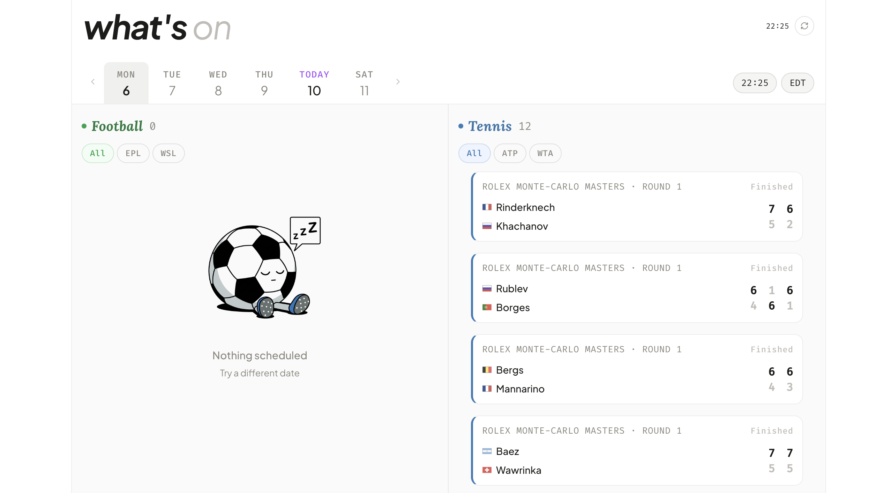

# What's on?

A personal app for tracking scheduled football games and tennis matches. 

## What this does

This app consolidates sports games I may be interested to follow in a single view, showing upcoming matches with start times and finished games with scores, so I don't need to open multiple tabs from different sources.

### Key Features

- Competitions are personally curated
- Adaptive view: football and tennis side by side on desktop, single panel on mobile
- Live and upcoming matches are highlighted to help plan what to watch
- Date strip to browse beyond what's on for today
- No API key required

<br>



### What's covered

Only leagues and tournaments I may actually follow are included. 

|   | Current coverage | How to modify |
|---|---|---|
| Football | EPL, WSL, UCL, UEL, UWCL, the World Cup | `LEAGUES` in `src/lib/espn-soccer.ts` |
| Tennis | Grand Slams, Masters 1000 / WTA 1000, year-end finals | `PRESTIGE_KEYWORDS` in `src/lib/espn-tennis.ts` |

Data sourced from the unofficial [ESPN Public API](https://github.com/pseudo-r/Public-ESPN-API). Coverage is limited to what ESPN carries and the API may change without notice.

## Running Locally

```bash
npm install
npm run dev
```

Open [http://localhost:3000](http://localhost:3000).


## Credits
- Code: Claude Code
- Illustrations: Gemini
